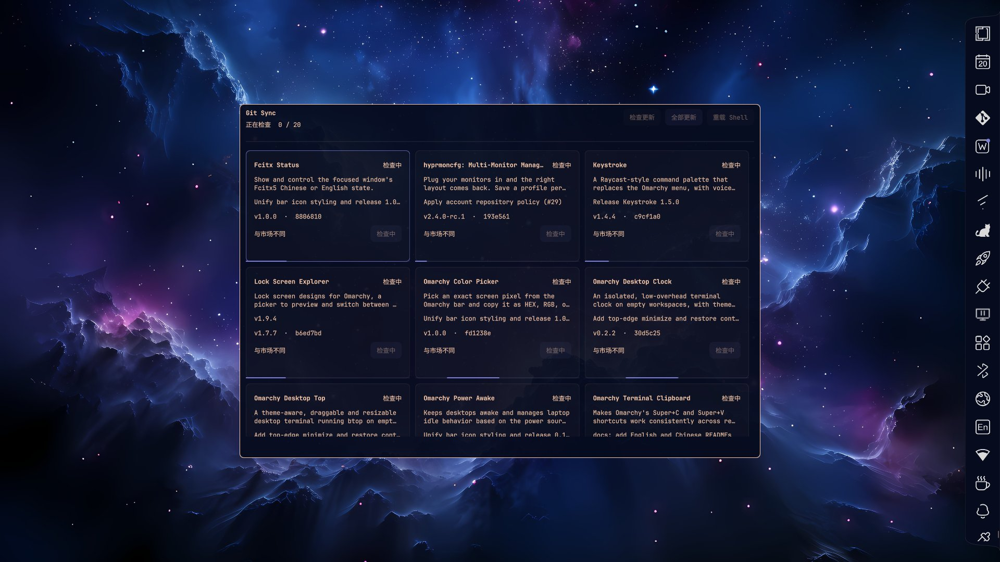

# Omarchy Git Sync

English | [简体中文](README.zh-CN.md)



A compact Omarchy panel for updating plugins from Git and comparing installed versions with the official plugin marketplace.

## Features

- Grid cards show each plugin's name, description, latest commit and marketplace match.
- Check for updates, update one or all plugins, and restart Shell.
- Animated progress. Cards keep their order during checks and sort once all checks finish, with available updates first.
- Update tasks continue after closing the panel. After an update reloads or restarts Shell, an open panel returns to its original monitor, even if focus has moved elsewhere.

## Install

Requires Omarchy Quattro with custom Shell plugins, Git and Python 3.12+. No extra Python packages are needed.

```sh
git clone https://github.com/manateelazycat/omarchy-git-sync.git
cd omarchy-git-sync
./install.sh
```

Installs to `~/.config/omarchy/plugins/andy.git-sync` and adds the icon to the right side of the bar. The installer backs up existing files and configuration, disables the system focus border for this window, and restarts Shell once.

## Usage

Click the bar icon to open the centered window, or run:

```sh
omarchy-shell shell summon andy.git-sync
```

- Close with **Super+W**, **Esc**, or the bar icon. Clicking outside keeps the window open; Esc returns from details first.
- **F5** or middle-click the icon to check updates; **Ctrl+U** to update all.
- Opening the panel checks automatically if the last check was over five minutes ago.
- Retry only checks the selected plugin and refreshes its card. It does not install files or reload Shell.

## Versions and sources

- Updates follow Git upstream. Marketplace match compares the installed version with the [official plugin marketplace](https://github.com/omacom/omarchy-plugin-marketplace/blob/main/registry.json).
- Older Git commits offer an update; changed files or an unidentified installed copy offer a sync.
- Development symlinks can become independent installations. Your development directory stays intact.
- Updates back up the original plugin, replace Git-managed files and records, and preserve extra configuration files. Local edits to Git-managed files are overwritten; unpushed or diverged commits need to be resolved first.
- Built-in plugins and local plugins without a Git source are not updated here.

## Data and commands

State and backups: `~/.local/state/omarchy-git-sync/`. Git and marketplace cache: `~/.cache/omarchy-git-sync/`. XDG directory overrides are supported.

```sh
python3 backend.py check
python3 backend.py update <plugin-id>
python3 backend.py update all
python3 backend.py status
```

Checks leave installed files unchanged. Batch updates continue if one plugin fails and normally reload plugins once after installation.

## Development

```sh
python3 -m unittest discover -s tests -v
python3 tests/smoke_qml.py
python3 tests/smoke_retry.py
python3 tests/smoke_batch_reload.py
```

Tests use temporary Git repositories and plugins. QML tests require a running Wayland session and use private or stubbed Shell instances.

## License

Copyright (C) 2026 Andy Stewart.

[GPL-3.0-only](LICENSE).
